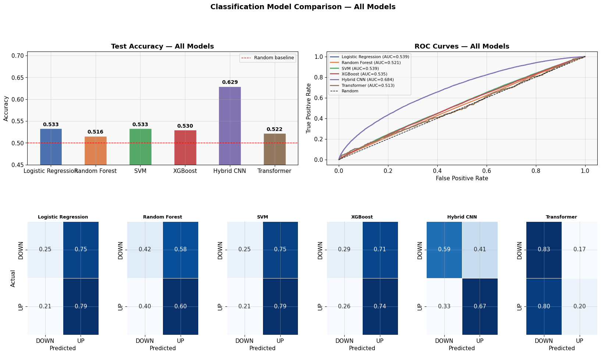

# Stock Forecasting with Deep Learning

A machine learning project demonstrating next-day stock price direction prediction using two custom deep learning architectures benchmarked against classical ML models. Built to showcase applied ML engineering skills across the full pipeline — from data ingestion to cloud deployment.

> **Note:** This project is intended as a portfolio demonstration of ML and software engineering ability utilizing time-series data, not a production trading system.

---

## Models

### Hybrid CNN
A custom architecture that combines handcrafted technical features with convolutional features extracted directly from the raw price signal. Both feature streams are fused into a combined classifier network.

- **Classification:** Predicts whether next-day price goes up or down
- **Regression:** A separate variant predicts the magnitude of next-day price change
- Outperforms best-performing benchmark model by **9.6%** in directional accuracy

### Transformer
A sequence model that captures long-range temporal dependencies in stock time series data to predict next-day price direction.

- Deployed as a REST API via **FastAPI**
- Containerized with **Docker** and hosted on **AWS EC2**

---

## Benchmark Comparison

The two custom models are evaluated against classical ML baselines:

| Model | Type |
|---|---|
| Logistic Regression | Baseline |
| SVM | Baseline |
| Random Forest | Baseline |
| XGBoost | Baseline |
| Hybrid CNN | Custom |
| Transformer | Custom |

Full results and analysis: [`notebooks/model_result_comparison.ipynb`](notebooks/model_result_comparison.ipynb)

### Results

<!-- Add your results comparison chart/image here -->


---

## Pipeline Overview

```
Training Pipeline:
yfinance Data → Feature Extraction → Preprocessing → Model Training → Saved Model

Serving Pipeline:
Stock Ticker → Fetch Data → Preprocess → Load Model → Prediction
```

### Training pipeline

1. **Data** — Stock price data pulled via `yfinance`
2. **Feature engineering** — Handcrafted technical features + raw price signal extraction
3. **Preprocessing** — Normalization, windowing, train/val/test split
4. **Training** — PyTorch models with MLflow experiment tracking
5. **Serialization** — Best model checkpoint saved to disk

### Serving pipeline

1. **Request** — User submits a stock ticker via FastAPI
2. **Data fetch** — data pulled via `yfinance`
3. **Preprocessing** — Same normalization + windowing applied at inference time
4. **Inference** — Transformer model loaded from checkpoint, prediction generated
5. **Response** — Predicted next-day performance returned as JSON

---

## Tech Stack

- **ML Framework:** PyTorch
- **Classical ML:** scikit-learn
- **Data:** yfinance
- **Experiment Tracking:** MLflow
- **API:** FastAPI
- **Deployment:** Docker + AWS EC2

---

## Setup

### Prerequisites
- Python 3.9+
- pip

---

## Running the Hybrid CNN Model

### Train

```bash
python train_hybrid.py
```

This will:
- Pull stock data via yfinance
- Extract features and preprocess
- Train the Hybrid CNN model
- Log the run and save the model via MLflow

### Predict

```bash
python predict_hybrid.py
```

This will load the trained model and run inference on new data, outputting a buy/sell signal for the next day.

---

## Accessing the Deployed Transformer Model

The Transformer model is deployed as a REST API on AWS EC2. Enter a stock ticker, and the next-day price will be predicted.

**Base URL:**
```
http://18.216.184.144/
```

**API Docs (Swagger UI):**
```
http://18.216.184.144/docs
```

---

## Experiment Tracking

MLflow is used to track all training runs, log metrics, and save model artifacts.

---

## Project Structure

```
Stock-Forecast-ML/
├── train_hybrid.py              # Train the Hybrid CNN model
├── predict_hybrid.py            # Run inference with Hybrid CNN
├── notebooks/
│   └── model_result_comparison.ipynb  # Benchmark vs. custom results
├── src/
│   └── data/                    # Files for loading, preprocessing data
│   └── models/                  # Files for building/training models
│   └── utils.py                 # Supporting functions
├── Dockerfile                   # Container config for Transformer API
└── requirements.txt
```

---

## Author

Built as a portfolio project to demonstrate applied machine learning engineering skills including custom architecture design, experiment tracking, and cloud deployment.
